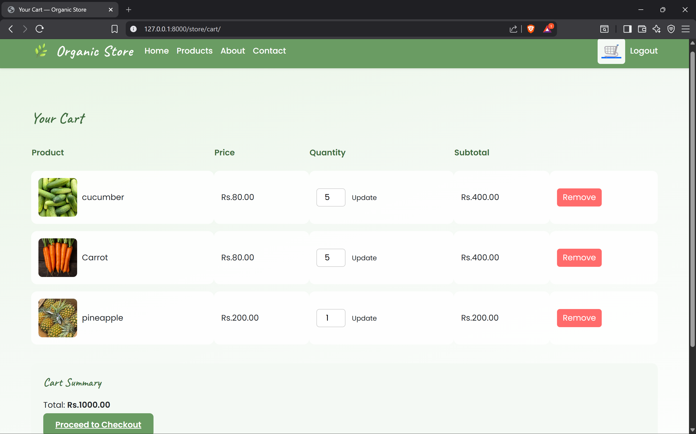
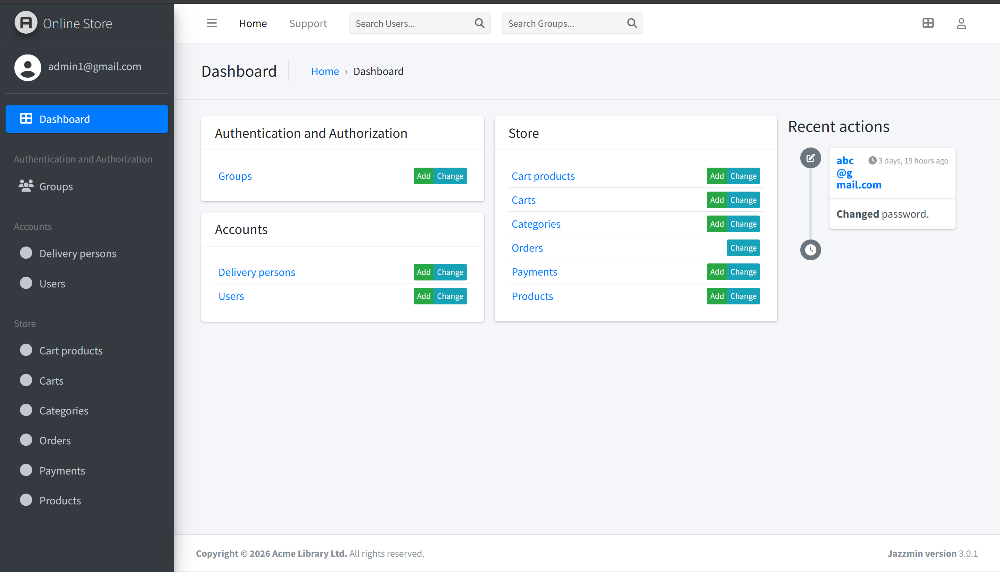

# Online Store – Django E-commerce Application

A Django-based e-commerce web application implementing core online shopping functionality including product management, cart system, order processing, and payment integration concepts.

## 🚀 Features

### 👤 User & Authentication
- Custom user model with email-based authentication  
- Role-based system:
  - Customer  
  - Delivery Person  
  - Admin  
- JWT Authentication (Django REST Framework)  
- User-specific data access (secure APIs)  

---

### 📦 Products & Categories
- Product CRUD (Admin controlled)  
- Category management  
- Many-to-many relationship (Products ↔ Categories)  
- Product filtering & sorting:
  - By name  
  - By category  
  - By price range  
- Featured products (admin only)  
- Image upload support  

---

### 🛒 Cart System (Fully Functional)
- Add to cart (custom API logic)  
- Update item quantity  
- Remove items from cart  
- Auto cart creation per user  
- Nested cart items response (Cart → CartProducts)  
- Total price calculation (per item & whole cart)  
- One cart per user (OneToOne relationship)

---

### 🔌 REST API (Django REST Framework)
- Built using ViewSets + APIViews  
- JWT Authentication secured endpoints  
- Separate serializers for public & admin views  
- Custom business logic APIs:
  - Add to cart  
  - Update cart  
  - Remove from cart  
- User-specific querysets (data isolation)

---

### 📑 Orders
- Place orders from cart  
- Order history  
- Order cancellation  
- Order status tracking:
  - Pending  
  - Paid  
  - Shipped  
  - Delivered  
  - Cancelled  
- Order history per user  

---

### 💳 Payment Integration (Khalti – Implemented)
- Khalti ePayment integration (test environment) 
- Payment verification logic implemented  
- Transaction ID & pidx handling  
- Order ↔ Payment relationship  
- Payment status tracking:
  - Initiated  
  - Pending  
  - Success  
  - Failed  
  - Refunded  

---

### 🚚 Delivery Person Module
- Separate delivery person profile  
- Age validation (18+)  
- Document upload (citizenship & driving license)  
- Vehicle details  
- Verification logic  

---

## 🛠️ Tech Stack
- **Backend:** Python, Django, Django REST Framework  
- **Database:** SQLite (can be switched to PostgreSQL)  
- **Authentication:** JWT (SimpleJWT)  
- **Frontend:** Django Templates (HTML, CSS)  
- **Payment Gateway:** Khalti API (Sandbox)  
- **Others:** Django ORM, Media handling, REST APIs

---

## 📂 Project Structure

online-store/
│
├── accounts/              # User model, authentication, delivery profiles & APIs
│
├── store/                 # Products, cart, orders, payment logic & APIs
│
├── common_templates/      # Shared templates
│
├── project/               # Main Django project settings
│
├── manage.py
│
└── requirements.txt
---

## ⚙️ Installation & Setup

1. Clone the repository
    git clone https://github.com/mandip-adk/online-store.git
    cd online-store
2. Create and activate virtual environment
    python -m venv venv
    source venv/bin/activate   # Linux/Mac
    venv\Scripts\activate      # Windows
3. Install dependencies
    pip install -r requirements.txt
4. Run migrations
    python manage.py migrate
5. Create superuser
    python manage.py createsuperuser
6. Start the development server
    python manage.py runserver
7. Open in browser
    http://127.0.0.1:8000/

---

## 🔑 API Highlights

| Endpoint | Method | Description |
|--------|--------|------------|
| `/api/products/` | GET | List products |
| `/api/cart/` | GET | Get user cart |
| `/api/add-to-cart/` | POST | Add item to cart |
| `/api/update-cart/` | POST | Update quantity |
| `/api/remove-from-cart/` | POST | Remove item |
| `/api/token/` | POST | JWT login |

---

## ⚠️ Notes
- Khalti integration uses sandbox/test environment  
- Designed for learning and portfolio purposes (not production-ready)  
- Can be extended with React frontend or deployed using AWS  

---

## 📸 Screenshots

### 🏠 Home Page

### 📦 Product Listing

### 🛒 Cart Page

### 📑 Orders

### 🔑 Admin Panel

---

## 🌐 Future Improvements

- Frontend using React / Next.js  
- Deployment on AWS (EC2 + S3)  
- Payment webhook handling  
- Real-time order tracking  

---

## 👤 Author
**Mandip Adhikari**  
GitHub: https://github.com/mandip-adk

